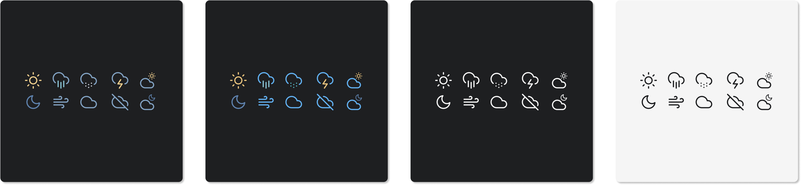
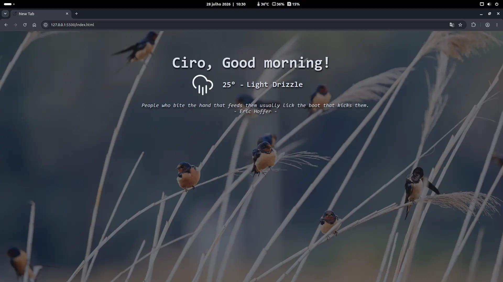

<h2>A Clean and Simple Startpage</h2>

<p align="center">
    
    
    
    
</p>

## ⚠️ Disclaimer

**I didn't develop the elements of this project**, I just put the pieces of the puzzle together to make it work based on what I would like to have.

## ⭐ Based on:

- [Bento of MiguelRAvila](https://github.com/MiguelRAvila/Bento)
- [ZenQuotes API](https://docs.zenquotes.io/zenquotes-documentation/).
- [Bing Wallpapers](https://www.bing.com/hp/api/v1/imagegallery).

> [!WARNING]
> You must check the licenses of the respective components if you wish to use any of them commercially.

## ✨ Features:

- **Greetings** = Are easy to change to your name.
- **Quotes** = Expressions to stimulate your thought or inspire your day.
- **Weather Icons** = Provided by [Bento of MiguelRAvila](https://github.com/MiguelRAvila/Bento).
- **Weather** = Provided by [ Open-Meteo](https://open-meteo.com/en/docs).
- **Random Wallpapers** = Provided by [TimothyYe API](https://github.com/TimothyYe/bing-wallpaper).
- **Responsive** = Will adapt to most devices.
- **No API key is required.**

## 🎨 Customization

The files needed for editing below are contained in the `js` and `css` folder.

### 🌑 Colors and font size:

The main colors can be customized through the file `style.css`.

> [!TIP]
>You can customize the font size and color via lines **4** to **8** of the file.

### ⛈️ Weather Info:

You will need to set your `latitude` and `longitude`, you can use: `https://www.latlong.net/` to get them.

Once you have the data you will need to configure it in the `weather.js` file on lines **2** for your language, **67** and **68** respectively.

### ☁️ Weather Icons:



- For example if you want the White icon theme, change the `White` to `Nord`.

> [!TIP]
>You can set the icon theme changing the variable in the line **5** on `weather.js` file:

### 👋 Greetings:

In line **5** until **9** of the `greeting.js`:

```js
var myname = 'Ciro';
var lateTxt = 'GO TO SLEEP!!!';
var morningTxt = 'Good morning!';
var afterTxt = 'Good afternoon!';
var evenTxt = 'Good evening!';
```

> [!TIP]
>You should put your name and change the greetings translations messages for your language.

### 🌉 Wallpapers

Change line **1** to choose between random images or the Bing image of the day.

## 🚀 Usage

### 🏡 As Home Page:
1. Fork this repo.
2. Enable the Github Pages service `Settings` » `Pages` » `Source branch [main branch]` » `Save`.
3. Or publish it to [Netlify](https://www.netlify.com/).

### ➕ As New Tab:
1. You can use different Extensions:
  - If you use Firefox: [Custom New Tab Page](https://addons.mozilla.org/en-US/firefox/addon/new-tab-override/).
  - If you use Chromium (Brave, Vivaldi, Chrome): [Custom New Tab URL](https://chrome.google.com/webstore/detail/custom-new-tab-url/mmjbdbjnoablegbkcklggeknkfcjkjia).

### 🐳 In a Docker Container

You can run this Simple Startpage in a Docker Container buildind your own imagem provided by my `Dockerfile` included or via also included `docker-compose` file.

#### Docker Container Run
1. Clone this repo.
2. `docker buildx build -t startpage .`
3. `docker run -d --restart=unless-stopped -p 8080:8080 startpage`
4. The page will be available at the port 8080: `localhost:8080`

#### docker-compose
1. Clone this repo.
2. `docker-compose -d up`
3. The page will be available at the port 8080: `localhost:8080`

## 💻 Final appearance


