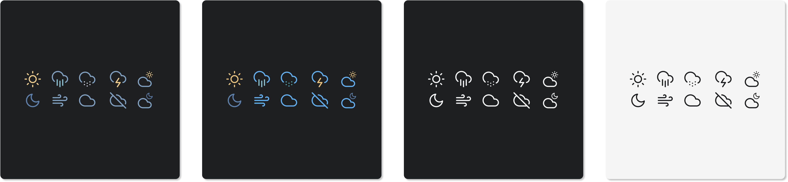
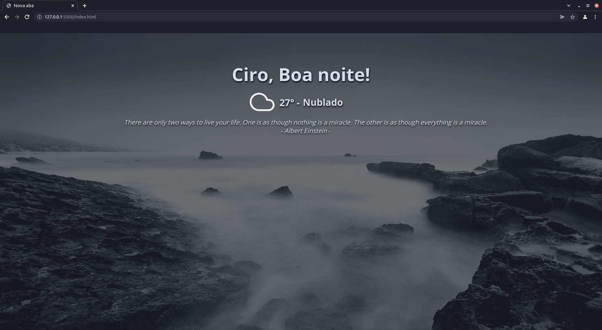

<div align="center">
    <h1>Clean e Simples Startpage</h1>
</div>


## Disclaimer

**Eu não desenvolvi os elementos deste projeto**, apenas juntei as peças do quebra-cabeças para fazer ele funcionar, com base naquilo que eu gostaria de ter. As mudanças realizadas foram feitas de forma empírica. Vocês provavelmente terão maneiras melhores de fazer o que eu fiz.
## Baseado em:

- [Bento of MiguelRAvila](https://github.com/MiguelRAvila/Bento).
- [forismatic](http://forismatic.com/en/api/) API [código de exemplo](https://codepen.io/catapixel/pen/LpVEgy).
- [Reddit API](https://www.reddit.com/dev/api/) com [wallpaper aleatórios](https://stackoverflow.com/questions/8191105/how-to-extract-url-data-from-reddit-api-using-json?rq=1).

## Recursos:

- **Saudações** = Fácil de mudar para o seu nome.
- **Citações** = Citações para estimular seu pensamento ou inspirar seu dia.
- **Icones de clima** = Criados por [Bento of MiguelRAvila](https://github.com/MiguelRAvila/Bento).
- **Clima** = Provido por OpenWeatherMap.
- **Wallpapers aleatórios** = Provido por Reddit API.
## Customização

Os arquivos necessários para edição abaixo estão contidos na pasta `js`.
### Cores e tamanho da letra:

Você pode personalizar o tamanho das letras e cor através das linhas **4** a **8** do arquivo `style.css`.
### Clima:

Para configurar o Clima você precisará de uma API Key em: `https://openweathermap.org/`. Depois de ter sua chave, você precisará definir sua latitude e longitude, você pode usar: `https://www.latlong.net/` para obtê-los. Assim que tiver os dados você precisará configurá-los no arquivo `weather.js` nas linhas **16**, **24** e **25** respectivamente.

> Se você não quiser que sua chave de API seja pública (e o Github desencoraja essa publicação devido a questões de segurança), poderá tornar o repositório privado. Você ainda poderá usar o serviço Github Pages ou Netlify.

### Icones de clima:



Você define o tema do ícone alterando a linha **54** no arquivo `weather.js`:

- Por exemplo, se você quiser o tema do ícone White, altere o `White` para `Nord`

### Saudações:

Nas linhas **5** até **9** do arquivo `greeting.js` você deverá colocar seu nome e traduzir as mensagens para seu idioma.

```js
var name = 'Ciro';
var lateTxt = 'GO TO SLEEP!!!';
var morningTxt = 'Good morning!';
var afterTxt = 'Good afternoon!';
var evenTxt = 'Good evening!';
```
## Uso

#### Como Home Page:
1. Fork este repo.
2. Ative o Github Pages em `Settings` » `Pages` » `Source [main branch]` » `Save`.
3. Ou publique-o no [Netlify](https://www.netlify.com/).

#### Como nova aba:
1. Você pode usar extensões diferentes
  - No Firefox: [Custom New Tab Page](https://addons.mozilla.org/en-US/firefox/addon/custom-new-tab-page/?src=search).
  - No Chromium (Brave, Vivaldi, Chrome): [Custom New Tab URL](https://chrome.google.com/webstore/detail/custom-new-tab-url/mmjbdbjnoablegbkcklggeknkfcjkjia).

## Aparência final: 




